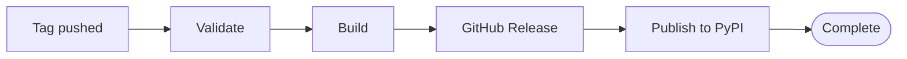

# Releasing

> **Note:** `rhiza-tools` no longer ships `bump`, `release`, or `rollback`
> commands. Version bumping and release orchestration have moved out of this
> package. Releasing is now driven entirely by pushing a version tag, which the
> CI/CD pipeline reacts to.

## Triggering a release

A release is triggered by pushing a git tag matching `v*` (e.g. `v1.2.3`) to the
remote. In outline:

1. Update the `version` in `pyproject.toml` and commit it (use your team's
   release tooling to generate the bump commit and CHANGELOG entry).
2. Create an annotated tag for the new version: `git tag -a v1.2.3 -m "v1.2.3"`.
3. Push the commit and tag: `git push && git push origin v1.2.3`.

The tag must be newer than the latest published version — the workflow refuses
to release a version that is not strictly greater than the highest already
released (issue #1126).

## CI/CD pipeline

Once the tag is pushed, the automated pipeline (`.github/workflows/rhiza_release.yml`)
takes over:

## Troubleshooting

| Problem                        | Solution                                          |
|--------------------------------|---------------------------------------------------|
| "Tag already exists" error     | The version was already released; pick a newer version |
| "Not newer than latest" error  | Sync with the default branch and bump to a higher version |
| Release workflow not triggered | Ensure the tag matches `v*` (e.g., `v1.2.3`)      |
