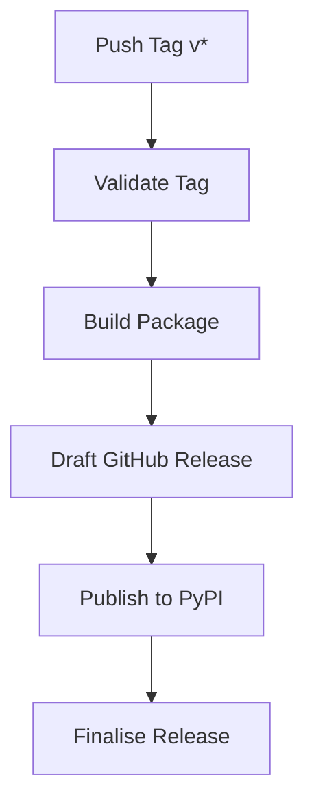

# Releasing

This guide covers the release workflow for Rhiza-based projects.

## Overview

Rhiza uses a tag-based release pipeline. Pushing a git tag matching `v*` triggers the automated release workflow, which builds, tests, and publishes the package.

## Quick Start

```bash
# Interactive bump + release (recommended)
make bump
make release

# Or use rhiza-tools directly
rhiza-tools release --with-bump --push
```

## Step-by-Step Release Process

### 1. Bump the Version

Use `make bump` to update the version in `pyproject.toml`. This runs interactively, prompting you to choose a bump type.

```bash
# Interactive selection
make bump

# Or specify directly
rhiza-tools bump patch
rhiza-tools bump minor
rhiza-tools bump major
```

Prerelease versions are also supported:

```bash
rhiza-tools bump alpha    # e.g. 1.2.3 → 1.2.4-alpha.1
rhiza-tools bump beta     # e.g. 1.2.3 → 1.2.4-beta.1
rhiza-tools bump rc       # e.g. 1.2.3 → 1.2.4-rc.1
```

Use `--dry-run` to preview changes without modifying files:

```bash
rhiza-tools bump minor --dry-run
```

### 2. Push the Release Tag

Use `make release` to validate the repository state and push the release tag:

```bash
make release
```

This performs the following pre-flight checks:

- Working tree is clean (no uncommitted changes)
- Branch is up-to-date with the remote
- Tag does not already exist on the remote
- Version follows semantic versioning

### 3. Automated Pipeline

Once the tag is pushed, the CI/CD pipeline automatically:

1. **Validates** the tag format
2. **Builds** the package
3. **Drafts** a GitHub Release
4. **Publishes** to PyPI (if configured and not a private repo)
5. **Finalises** the release



## Combined Bump and Release

For convenience, `rhiza-tools release` can bump and release in a single step:

```bash
# Interactive bump selection, then release
rhiza-tools release --with-bump --push

# Specify bump type directly
rhiza-tools release --bump PATCH --push

# Non-interactive (for CI/CD)
rhiza-tools release --bump MINOR --push --non-interactive
```

## Options Reference

### `make bump`

Runs the interactive version bump via `rhiza-tools bump`.

### `make release`

Validates the repository and pushes the release tag.

### `rhiza-tools release`

| Option               | Description                                          |
|----------------------|------------------------------------------------------|
| `--bump TYPE`        | Bump type (`MAJOR`, `MINOR`, `PATCH`) before release |
| `--with-bump`        | Interactively select bump type before release        |
| `--push`             | Push changes to remote                               |
| `--dry-run`          | Preview without making changes                       |
| `--non-interactive`  | Skip all confirmation prompts (for CI/CD)            |

### `rhiza-tools bump`

| Option          | Description                                           |
|-----------------|-------------------------------------------------------|
| `VERSION`       | Target version or bump type (or omit for interactive) |
| `--dry-run`     | Show what would change without modifying files        |
| `--commit`      | Automatically commit the version change               |
| `--push`        | Push changes to remote after commit                   |
| `--branch`      | Branch to perform the bump on                         |
| `--allow-dirty` | Allow bumping with uncommitted changes                |
| `--verbose`     | Show detailed bump-my-version output                  |

## Hooks

The release process supports pre/post hooks. Define them in your `Makefile`:

```makefile
pre-bump::
	@echo "Running pre-bump checks..."

post-bump::
	@echo "Version bumped, running post-bump tasks..."

pre-release::
	@echo "Preparing for release..."

post-release::
	@echo "Release complete, running cleanup..."
```

See [Customization](CUSTOMIZATION.md) for more on hooks.

## Troubleshooting

| Problem                        | Solution                                          |
|--------------------------------|---------------------------------------------------|
| "Uncommitted changes" error    | Commit or stash changes before releasing          |
| "Branch behind remote" error   | Pull the latest changes: `git pull`               |
| "Tag already exists" error     | The version was already released; bump again      |
| Release workflow not triggered | Ensure the tag matches `v*` (e.g., `v1.2.3`)     |
