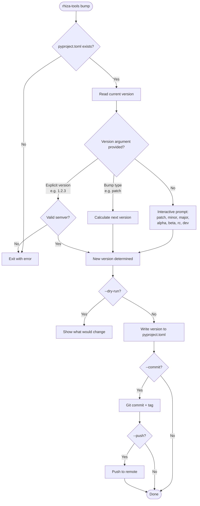
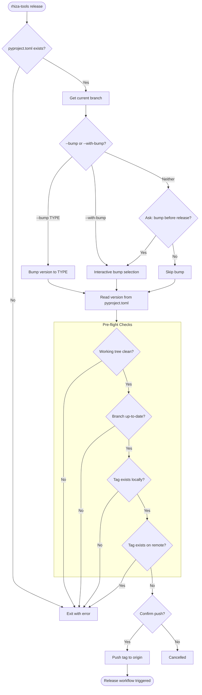

# Releasing

Guide to the `bump` and `release` commands provided by `rhiza-tools`.

## Overview

`rhiza-tools` provides two commands for version management:

- **`bump`** — updates the version in `pyproject.toml` using semantic versioning
- **`release`** — validates the repository state and pushes a release tag to trigger CI/CD

## Bump Command

### Flow



### Usage

```bash
# Interactive (prompts for bump type)
rhiza-tools bump

# Specific bump type
rhiza-tools bump patch
rhiza-tools bump minor
rhiza-tools bump major

# Prerelease
rhiza-tools bump alpha
rhiza-tools bump beta
rhiza-tools bump rc

# Explicit version
rhiza-tools bump 2.0.0

# Preview changes
rhiza-tools bump minor --dry-run
```

### Options

| Option          | Description                                           |
|-----------------|-------------------------------------------------------|
| `VERSION`       | Target version or bump type (or omit for interactive) |
| `--dry-run`     | Show what would change without modifying files        |
| `--commit`      | Automatically commit the version change               |
| `--push`        | Push changes to remote after commit                   |
| `--branch`      | Branch to perform the bump on                         |
| `--allow-dirty` | Allow bumping with uncommitted changes                |
| `--verbose`     | Show detailed bump-my-version output                  |

## Release Command

### Flow



### Usage

```bash
# Interactive (prompts for bump and push)
rhiza-tools release

# Bump and release in one step
rhiza-tools release --bump PATCH --push

# Interactive bump selection with dry-run preview
rhiza-tools release --with-bump --push --dry-run

# Non-interactive (for CI/CD)
rhiza-tools release --bump MINOR --push --non-interactive
```

### Options

| Option               | Description                                          |
|----------------------|------------------------------------------------------|
| `--bump TYPE`        | Bump type (`MAJOR`, `MINOR`, `PATCH`) before release |
| `--with-bump`        | Interactively select bump type before release        |
| `--push`             | Push changes to remote                               |
| `--dry-run`          | Preview without making changes                       |
| `--non-interactive`  | Skip all confirmation prompts (for CI/CD)            |

## CI/CD Pipeline

Once the tag is pushed, the automated pipeline takes over:


## Troubleshooting

| Problem                        | Solution                                          |
|--------------------------------|---------------------------------------------------|
| "Uncommitted changes" error    | Commit or stash changes before releasing          |
| "Branch behind remote" error   | Pull the latest changes: `git pull`               |
| "Tag already exists" error     | The version was already released; bump again      |
| Release workflow not triggered | Ensure the tag matches `v*` (e.g., `v1.2.3`)     |

